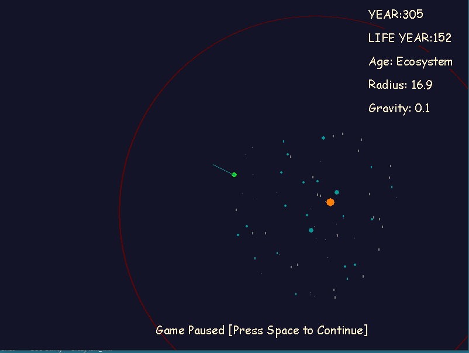

# wanderingplanet
pyweek 29 entry

How long can you make your planet survive?
Try to increase the time of your life in the planet, make it to civilization, you can get more force to control your planet.
Do let it crush by other big planets, don't let it become a star!

Gameplay video on youtube:
https://www.youtube.com/watch?v=LjKq_nqlsro

